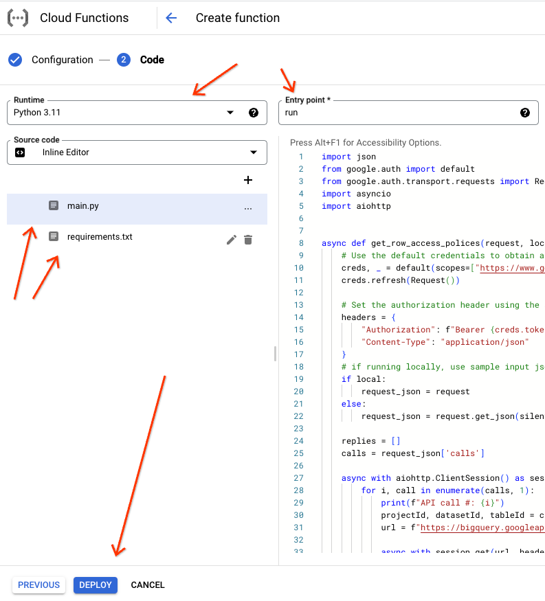

# Google Cloud BigQuery Row Level Access Policy Remote Function

A [BigQuery Remote Function](https://cloud.google.com/bigquery/docs/reference/standard-sql/remote-functions) for row-level access policies.

For an interactive tutorial within the Google Cloud Console and using [Cloud Shell](https://cloud.google.com/shell) click the button below:

[](https://console.cloud.google.com/bigquery/?cloudshell_git_repo=https://github.com/justinjm/gcp-bigquery-row-level-access&cloudshell_tutorial=README.md)

## Summary

This tutorial will walkthrough the following workflow to setup a Bigquery [Remote Function](https://cloud.google.com/bigquery/docs/reference/standard-sql/remote-functions):

* Setup GCP environment - enable APIs, connection between BigQuery and Cloud Functions
* Setup data in BigQuery - load data and implement example [row-level security policies](https://cloud.google.com/bigquery/docs/managing-row-level-security)
* Setup Google Cloud Function - Python function to call the BQ API ([`rowAccessPolicies` method](https://cloud.google.com/bigquery/docs/reference/rest/v2/rowAccessPolicies/list#RowAccessPolicy))
* Create [BigQuery Remote Function](https://cloud.google.com/bigquery/docs/reference/standard-sql/remote-functions) - as a [BigQuery User Defined Function (UDF)](https://cloud.google.com/bigquery/docs/reference/standard-sql/user-defined-functions) from a Google Cloud Function  
* Use BigQuery UDF - to fetch a BigQuery table's row-level access policies within BigQuery SQL

## Getting Started

**Recommendation:** To get started, follow this tutorial within the Google Cloud Console UI (Cloud Shell) by clickly the button (below) if you aren't already:

[](https://console.cloud.google.com/bigquery/?cloudshell_git_repo=https://github.com/justinjm/gcp-bigquery-row-level-access&cloudshell_tutorial=README.md)

Alternatively, can work from your local machine by 1) installing the [`gcloud` CLI](https://cloud.google.com/sdk/docs/install-sdk) and then 2) cloniog this repository via:  

```sh
git clone https://github.com/justinjm/gcp-bigquery-row-level-access \
  && cd gcp-bigquery-row-level-access/
```

### Set project ID environment variable

Set your desired project ID as an environment variable in your shell for use in later steps:

```sh
PROJECT_ID=$(gcloud config get-value project)
```

If for some reason you do not have a project set, run the following and replace `your-project-id`:

```sh
export PROJECT_ID="your-project-id" && echo $PROJECT_ID
gcloud config set project $PROJECT_ID
```

## Setup GCP environment

### Enable apis

First, enable the following APIs within the [GCP web console](https://console.developers.google.com/apis/api/bigqueryconnection.googleapis.com/) or by running the command below in Cloud Shell:

```sh
gcloud services enable bigqueryconnection.googleapis.com
```

### Setup connection

Create a [connection](https://cloud.google.com/bigquery/docs/reference/standard-sql/remote-functions#create_a_connection) between BigQuery and Cloud Functions

```sh
bq mk --connection --display_name='get_row_access_policies' \
    --connection_type=CLOUD_RESOURCE \
    --project_id=$PROJECT_ID \
    --location=US  \
    gcf-conn
```

Show connection info and copy the service account ("serviceAccountId") under "Properties, you will need this in a later step

```sh
bq show --location=US --connection gcf-conn
```

## Setup BigQuery

### Load Data

First, we create a BQ dataset called `z_test` in the [BigQuery console](https://console.cloud.google.com/bigquery) or running the `bq` CLI commands below:

```sh
bq mk -d z_test 
```

And then load the 2 example csv files from this repository into 2 BQ tables:

```sh
bq load --autodetect \
    --source_format=CSV \
    z_test.crm_account \
    ./data/crm_account.csv
```

```sh
bq load --autodetect \
    --source_format=CSV \
    z_test.crm_user \
    ./data/crm_user.csv
```

### Create row level access polices 

Then, we create row level access policies for each table by running the following SQL queries from within the [BigQuery](https://cloud.google.com/bigquery) console. Click the button below to be shown the way:

<walkthrough-menu-navigation sectionId="BIGQUERY_SECTION">BigQuery</walkthrough-menu-navigation>


#### 1. crm_account policy

```sql
CREATE ROW ACCESS POLICY crm_account_filter
ON `z_test.crm_account`
GRANT TO('user:your-email@domain.com')
FILTER USING(State_Code='CA')
```

#### 2. crm_user policy

```sql
CREATE ROW ACCESS POLICY crm_user_filter
ON `z_test.crm_user`
GRANT TO('user:your-email@domain.com')
FILTER USING(Country_Code='US')
```

## Setup Google Cloud Function

Now that our sample data is loaded in BigQuery, let's avigate to [Cloud Functions](https://console.cloud.google.com/functions) within the Google Cloud console and setup a Cloud function as follows. For this workflow, we will use 1st Gen Cloud functions.  Click the button below to be shown the way:

<walkthrough-menu-navigation sectionId="FUNCTIONS_SECTION">Cloud Functions</walkthrough-menu-navigation>

### 1. Configuration

On the configuration page, configure the following settings:

* Basics
  * environment: 1st gen
  * function name: `bq-table-row-access-policies`
  * region: `us-central1`
* Trigger
  * Trigger type: `HTTP`
  * leave the rest as defaults and click save 


Then, scroll to the bottom and click "Next"


### 2. Code

On the Code page, configure the following settings:

* Runtime: `Python 3.11`
* Source code: Inline Editor 
* Entry point: `get_row_access_polices`

Then, select the `main.py` file on the left-hand side and copy the code from the `main.py` file from this repository.

Repeat for  `requirements.txt` and then click "DEPLOY" 



### Grant service accounts acccess

While GCF is deploying, grant account access in 2 places

1. the app engine default service account BigQuery permissions so that the cloud function can access BQ (you can remove/adjust this later):

```sh
gcloud projects add-iam-policy-binding $PROJECT_ID \
    --member=serviceAccount:$PROJECT_ID@appspot.gserviceaccount.com \
    --role=roles/bigquery.admin
```

1. Grant service account from BQ connection `get-row-access-policies` created earlier via`bq mk --connection` to allow BQ to invoke the Cloud Function from SQL (i.e. - replace `your-service-account`):

```sh
gcloud functions add-iam-policy-binding get-row-access-policies \
    --member=serviceAccount:your-service-account@gcp-sa-bigquery-condel.iam.gserviceaccount.com \
    --role=roles/cloudfunctions.invoker
```

### Test Cloud Function

After deployment of the Cloud Function completes, test with sample values (replacing `your-project-id`):

```txt
{
  "calls": [
      ["your-project-id", "z_test", "crm_account"]
      ["your-project-id", "z_test", "crm_user"]
  ]
}
```

You should see a repsonse with the `rowAccessPolicies` as the main object.

## Create BigQuery UDF

Now, back to the [BigQuery console](https://console.cloud.google.com/bigquery)  and run the following SQL to create a BigQuery UDF from the Cloud Function we just created:

<walkthrough-menu-navigation sectionId="BIGQUERY_SECTION">BigQuery</walkthrough-menu-navigation>

```sql
CREATE OR REPLACE FUNCTION
  z_test.get_row_access_policies(table_catalog STRING,
    table_schema STRING,
    table_name STRING)
  RETURNS STRING REMOTE
  -- change this to reflect your PROJECT ID
WITH CONNECTION `your-project-id.us.gcf-conn` OPTIONS (
    -- change this to reflect the Trigger URL of your cloud function (look for the TRIGGER tab)
    endpoint = 'https://us-central1-your-project-id.cloudfunctions.net/get-row-access-policies' )
```

## Invoke remote function from BigQuery

Finally, use the Remote Function in a SQL query from the BigQuery [`INFORMATION_SCHEMA.TABLES` view](https://cloud.google.com/bigquery/docs/information-schema-tables):

```sql
SELECT
  table_catalog,
  table_schema,
  table_name,
  `z_test`.get_row_access_policies(table_catalog, table_schema, table_name) as rowAccessPolicies
FROM
  z_test.INFORMATION_SCHEMA.TABLES
```

A more robust query to format the raw JSON response into columns: 

```sql
WITH data AS (
  SELECT
  table_catalog,
  table_schema,
  table_name,
  `z_test`.get_row_access_policies(table_catalog, table_schema, table_name) as reply
FROM
  z_test.INFORMATION_SCHEMA.TABLES
) 
SELECT
  * EXCEPT(reply),
  REPLACE(JSON_QUERY(reply, '$.rowAccessPolicies[0].rowAccessPolicyReference.policyId'), '"', '') AS policyId,
  REPLACE(JSON_QUERY(reply, '$.rowAccessPolicies[0].filterPredicate'), '"', '') AS filterPredicate,
  REPLACE(JSON_QUERY(reply, '$.rowAccessPolicies[0].creationTime'), '"', '') AS creationTime,
  REPLACE(JSON_QUERY(reply, '$.rowAccessPolicies[0].lastModifiedTime'), '"', '') AS lastModifiedTime

FROM data
```


References:

* <https://cloud.google.com/bigquery/docs/reference/standard-sql/json_functions#string_for_json>
* <https://cloud.google.com/bigquery/docs/information-schema-tables>

## Resources

BigQuery Row Level Security

* [Use row-level security  |  BigQuery  |  Google Cloud](https://cloud.google.com/bigquery/docs/managing-row-level-security#bq)
* [Method: rowAccessPolicies.list  |  BigQuery  |  Google Cloud](https://cloud.google.com/bigquery/docs/reference/rest/v2/rowAccessPolicies/list#RowAccessPolicy)
* [HTTP Tutorial  |  Cloud Functions Documentation  |  Google Cloud](https://cloud.google.com/functions/docs/tutorials/http-1st-gen)

BigQuery Remote Functions

* [Working with Remote Functions  |  BigQuery  |  Google Cloud](https://cloud.google.com/bigquery/docs/reference/standard-sql/remote-functions#sample_code)
* [Remote Functions in BigQuery. How it works, and what you can do with… | by Lak Lakshmanan | Towards Data Science](https://towardsdatascience.com/remote-functions-in-bigquery-af9921498438) - good tutorial by former Googler

BigQuery Information Schema

* [TABLES view  |  BigQuery  |  Google Cloud](https://cloud.google.com/bigquery/docs/information-schema-tables)
