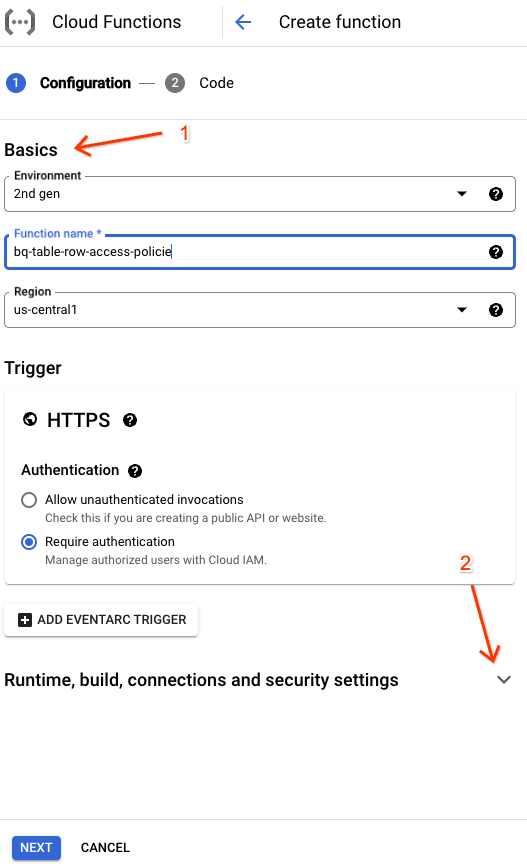
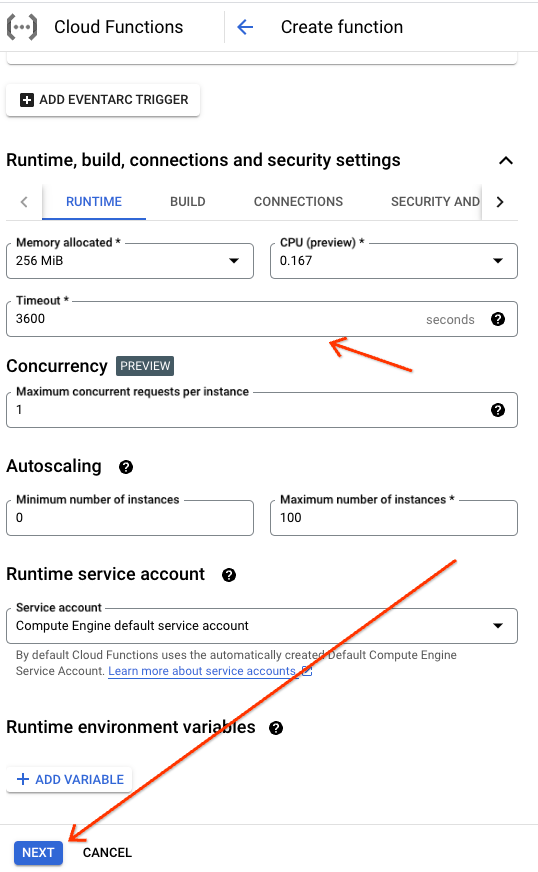

# Google Cloud BigQuery Row Level Access Policy Remote Function 

A [BigQuery Remote Function](https://cloud.google.com/bigquery/docs/reference/standard-sql/remote-functions) for row-level access policies.

To begin, click the button below:

[](https://console.cloud.google.com/cloudshell/open?git_repo=https://github.com/justinjm/gcp-bigquery-row-level-access&page=editor&tutorial=README.md)


## Summary

This tutorial will walkthrough the following workflow:

* Setup GCP environment - enable APIs, BQ connection
* Setup data in BigQuery - load data and implement example row-level security policies
* Setup Google Cloud function - Python function to call the BQ API (`rowAccessPolicies` method)
* Create BigQuery UDF - from Google Cloud Function  
* Use BigQuery UDF - to get rowAccessPolicies within SQL 

## Getting Started

To begin, follow the steps below in Cloud Shell and/or the Cloud Console. To clone this repository and work directly in Cloud Shell (recommended)

1. Click [here](https://shell.cloud.google.com/?show=ide%2Cterminal) to Open a Cloud Shell session
2. Set your project by running `gcloud config set project [PROJECT_ID]` 
3. clone this repository: `git clone https://github.com/justinjm/gcp-bigquery-row-level-access`


## Setup GCP environment 

### Enable apis

```sh
gcloud services enable bigqueryconnection.googleapis.com
```

### Setup connection

```sh
gcloud components update
bq mk --connection --display_name='get_row_access_policies' \
    --connection_type=CLOUD_RESOURCE \
    --project_id=$(gcloud config get-value project) \
    --location=US  \
    gcf-conn
```

Show connection info and copy service account, you will need this in a later step

```sh
bq show --location=US --connection gcf-conn
```

## Setup BigQuery 

### Load Data

First, we create a BQ dataset

```sh
bq mk -d z_test 
```

and then load the 2 example csv files from this repository into 2 BQ tables

```sh
bq load --autodetect \
    --source_format=CSV \
    demos-vertex-ai:z_test2.crm_account \
    ./data/crm_account.csv
```

```sh
bq load --autodetect \
    --source_format=CSV \
    demos-vertex-ai:z_test2.crm_user \
    ./data/crm_user.csv
```

Then, create row level access policies for each table

#### 1. crm_account policy

```sql
CREATE ROW ACCESS POLICY crm_account_filter
ON `demos-vertex-ai.z_test.crm_account`
GRANT TO('user:bruce@justinjm.altostrat.com')
FILTER USING(State_Code='CA')
```

#### 2. crm_user policy

```sql
CREATE ROW ACCESS POLICY crm_user_filter
ON `demos-vertex-ai.z_test.crm_user`
GRANT TO('user:bruce@justinjm.altostrat.com')
FILTER USING(Country_Code = 'US')
```

## Setup Google Cloud Function

Navigate to [Cloud Functions](https://console.cloud.google.com/functions) within the Google Cloud console and setup a Cloud function as follows. For this workflow, we will use 1st Gen Cloud functions  

### 1. Configuration 

On the configuration page, configure the following settings:

* Basics
  * environment: 1st gen
  * function name: `bq-table-row-access-policies`
  * region: `us-central1`
* Trigger
  * Trigger type: `HTTP`
  * leave the rest as defaults and click save 




Then, scroll to the bottom and click "Next"





### 2. Code 

On the Code page, configure the following settings:

* Runtime: `Python 3.11`
* Source code: Inline Editor 
* Entry point: `get_row_access_polices`

Then, select the `main.py` file on the left-hand side and copy the code from the `main.py` file from this repository.

Repeat for  `requirements.txt` and then click "DEPLOY" 


### Grant service accounts acccess

While GCF is deploying, grant account access in 2 places

1. the app engine default service account BigQuery permissions so that the cloud function can access BQ (you can remove/adjust this later):

```sh
gcloud projects add-iam-policy-binding demos-vertex-ai \
    --member=serviceAccount:demos-vertex-ai@appspot.gserviceaccount.com \
    --role=roles/bigquery.admin
```

2. Grant service account from BQ connection created earlier to allow BQ to invoke the Cloud Function from SQL:

```sh
gcloud functions add-iam-policy-binding bq-table-row-access-policies \
    --member=serviceAccount:bqcx-746038361521-agnk@gcp-sa-bigquery-condel.iam.gserviceaccount.com \
    --role=roles/cloudfunctions.invoker
```

### Test Cloud Function 

After deployment completes, test with sample values:

```txt
{
  "calls": [
      ["your-project-id", "z_test", "crm_account"]
      ["your-project-id", "z_test", "crm_user"]
  ]
}
```

You should see a repsonse with the `rowAccessPolicies` as the main object. 

## Create BigQuery UDF

Now, navigate to BigQuery UI and run the following SQL to create a BigQuery UDF

```sql
CREATE OR REPLACE FUNCTION
  z_test.get_row_access_policies(table_catalog STRING,
    table_schema STRING,
    table_name STRING)
  RETURNS STRING REMOTE
  -- change this to reflect your PROJECT ID
WITH CONNECTION `demos-vertex-ai.us.gcf-conn` OPTIONS (
    -- change this to reflect the Trigger URL of your cloud function (look for the TRIGGER tab)
    endpoint = 'https://us-central1-demos-vertex-ai.cloudfunctions.net/bq-table-row-access-policies' )
```

## Invoke remote function from BigQuery

Finally, use the UDF (and Remote Function) in a SQL query from the `INFORMATION_SCHEMA`: 

```sql
SELECT
  table_catalog,
  table_schema,
  table_name,
  `z_test`.get_row_access_policies(table_catalog, table_schema, table_name) as rowAccessPolicies
FROM
  z_test.INFORMATION_SCHEMA.TABLES
```

A more robust query to format the raw JSON response into columns: 

```sql
WITH data AS (
  SELECT
  table_catalog,
  table_schema,
  table_name,
  `z_test`.get_row_access_policies(table_catalog, table_schema, table_name) as reply
FROM
  z_test.INFORMATION_SCHEMA.TABLES
) 
SELECT
  * EXCEPT(reply),
  REPLACE(JSON_QUERY(reply, '$.rowAccessPolicies[0].rowAccessPolicyReference.policyId'), '"', '') AS policyId,
  REPLACE(JSON_QUERY(reply, '$.rowAccessPolicies[0].filterPredicate'), '"', '') AS filterPredicate,
  REPLACE(JSON_QUERY(reply, '$.rowAccessPolicies[0].creationTime'), '"', '') AS creationTime,
  REPLACE(JSON_QUERY(reply, '$.rowAccessPolicies[0].lastModifiedTime'), '"', '') AS lastModifiedTime

FROM data
```


References:

* <https://cloud.google.com/bigquery/docs/reference/standard-sql/json_functions#string_for_json>
* <https://cloud.google.com/bigquery/docs/information-schema-tables>

## Resources

BigQuery Row Level Security

* [Use row-level security  |  BigQuery  |  Google Cloud](https://cloud.google.com/bigquery/docs/managing-row-level-security#bq)
* [Method: rowAccessPolicies.list  |  BigQuery  |  Google Cloud](https://cloud.google.com/bigquery/docs/reference/rest/v2/rowAccessPolicies/list#RowAccessPolicy)
* [HTTP Tutorial  |  Cloud Functions Documentation  |  Google Cloud](https://cloud.google.com/functions/docs/tutorials/http-1st-gen)

BigQuery Remote Functions

* [Working with Remote Functions  |  BigQuery  |  Google Cloud](https://cloud.google.com/bigquery/docs/reference/standard-sql/remote-functions#sample_code)
* [Remote Functions in BigQuery. How it works, and what you can do with… | by Lak Lakshmanan | Towards Data Science](https://towardsdatascience.com/remote-functions-in-bigquery-af9921498438) - good tutorial by former Googler

BigQuery Information Schema

* [TABLES view  |  BigQuery  |  Google Cloud](https://cloud.google.com/bigquery/docs/information-schema-tables)
